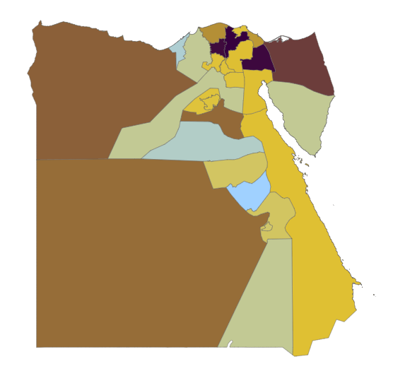
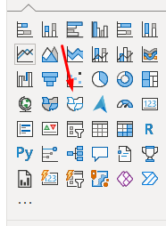
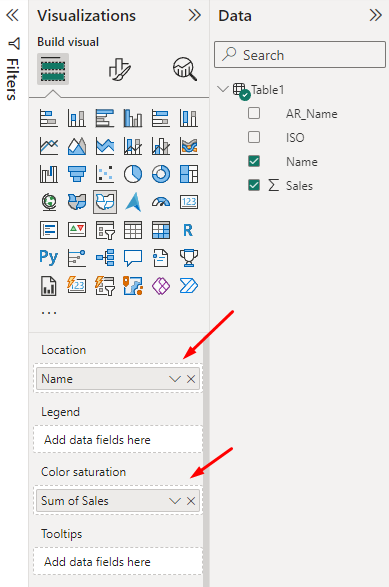
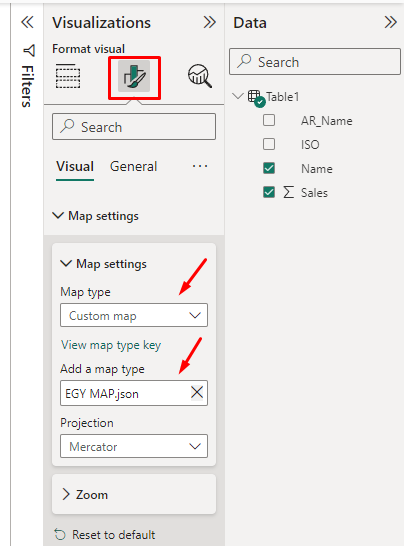

# Egypt Shape Map

### 1- First, you will choose the shape map from the visuals

### 2- Secondly, you will add your data that contains the names of the governorates or the governorate’s ISO

### 3- In the end, you will enter the visual format menu and click on map setting, from the map type list You will choose a custom map and you will add the map file.

### There is sample data with the map file
